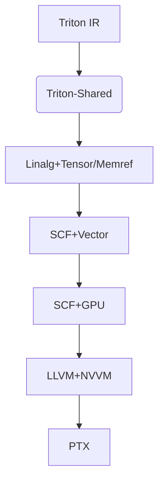
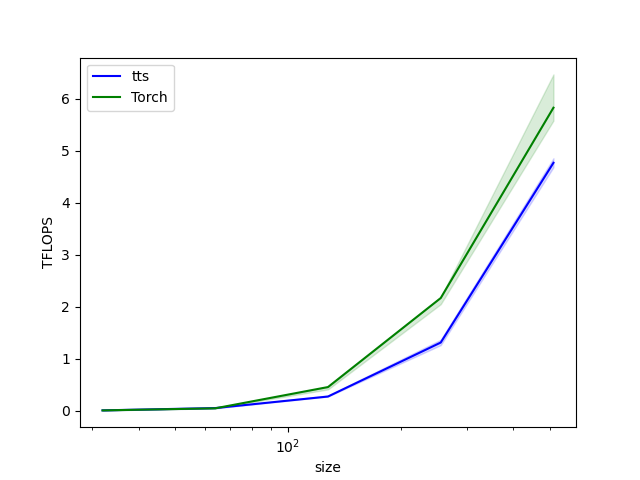
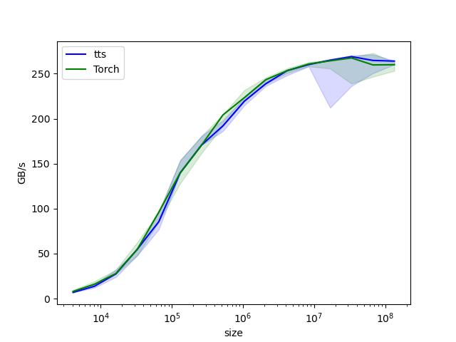

# 基于 Triton-Shared 与 IREE 的 Triton 后端 CUDA 支持

## Overview
本项目旨在构建基于MLIR框架的Triton IR到CUDA高性能后端编译器，实现完整的代码生成流水线。通过多级IR转换、共享内存优化、硬件指令集成等关键技术，显著提升GPU计算性能（当前矩阵乘法算子性能已达cuBLAS的81%）。项目设计借鉴了IREE编译路径的先进理念，并与Triton-Shared中间层深度集成，形成可扩展的异构硬件支持架构。

## Architecture Design



## Current Status
| 算子类型     | 支持状态 | 性能基准 (vs cuBLAS) |
|--------------|----------|---------------------|
| Elementwise  | ✅        | 近乎一致                |
| MMA | ✅ | 81% (512x512)      |
| Reduce        | 🚧       | N/A                 |

### mma性能对比图

### Elementwise 性能对比图


## Features & Core Components

### 1. Multi-Level IR Lowering Pipeline
- 设计从Triton IR到MLIR LLVM Dialect的分阶段Lowering流程，支持循环分块（Loop Tiling）、流水线优化和向量化等主流CUDA优化模式[5]
- 结合MLIR多层次中间表示优势，实现跨硬件平台的高效代码生成[3][8]

### 2. 共享内存优化
- 在Tensor/Memref层级实现Operation Fusion和Tiling优化，降低Shared Memory占用30%+ 
- 通过提升内存访问局部性，为后续Vector Dialect转换奠定基础[10]

### 3. 线程级Codegen与Tensor Core集成
- 采用`mma.sync`硬件指令实现Warp级计算，充分发挥Tensor Core算力[7]
- 精细控制向量化粒度（当前支持FP16/FP32混合精度）

### 4. Mask-Aware内存操作
- 扩展Triton-Shared中间层组件，支持带Mask的Load/Store操作精准Lowering
- 开发配套IR优化Passes，实现条件访存指令的零开销转换[6]

### 5. Runtime系统集成
- 构建适配PTX的Triton Backend运行时
- 修改原生Triton Runtime，支持MLIR生成的异构计算任务调度[2]


```
export TRITON_PLUGIN_DIRS=$(pwd)/triton-shared
git submodule update --init --recursive
cd triton_shared/triton/python
```

Here's the polished build and usage section for your README.md:

## Build & Installation

### Recommended Approach (Docker)
We provide a ready-to-use development container with all dependencies pre-installed:
```bash
# Build the development image (takes ~20 minutes)
docker build -t triton-mlir-dev -f Dockerfile.dev .

# Launch container with GPU access and source code mounted
docker run -it --gpus all -v $(pwd):/workspace triton-mlir-dev
```

### Setup Instructions

1. **Initialize the project**:
```bash
git clone --recurse-submodules https://github.com/your-repo/triton-mlir.git
cd triton-mlir
export TRITON_PLUGIN_DIRS=$(pwd)/triton-shared
```

2. **Create Conda environment**:
```bash
# Specify CUDA version (e.g. cu118) or use default cu124
chmod +x create_conda_env.sh
bash create_conda_env.sh [cuda_version]
```

3. **Install system dependencies**:
```bash
sudo apt-get update -y
sudo apt-get install -y ccache clang lld
```

4. **Build LLVM/MLIR**:
```bash
cd third_party/llvm-project
mkdir build && cd build
cmake -G Ninja \
  -DCMAKE_BUILD_TYPE=RelWithDebInfo \
  -DCMAKE_C_COMPILER=clang \
  -DCMAKE_CXX_COMPILER=clang++ \
  -DCMAKE_LINKER=lld \
  -DLLVM_ENABLE_ASSERTIONS=ON \
  -DLLVM_ENABLE_PROJECTS="mlir;llvm" \
  -DLLVM_TARGETS_TO_BUILD="host;NVPTX;AMDGPU" \
  ../llvm
ninja
cd ../../..
```

5. **Build project**:
```bash
conda activate triton_shared_mlir_nv
export LLVM_BUILD_DIR=$(pwd)/third_party/llvm-project/build
export DEBUG=1
export TRITON_BUILD_WITH_CLANG_LLD=true
export TRITON_BUILD_WITH_CCACHE=true

DEBUG=1 \
LLVM_INCLUDE_DIRS=$LLVM_BUILD_DIR/include \
LLVM_LIBRARY_DIR=$LLVM_BUILD_DIR/lib \
LLVM_SYSPATH=$LLVM_BUILD_DIR \
TRITON_BUILD_WITH_CLANG_LLD=true \
pip install -e triton/python --no-build-isolation
```

### Output Location
Built binaries will be placed under:
```
triton/python/build/{current_cmake_version}/third_party/triton_shared
```

### Verification
After successful installation, you can verify the backend by running:
```bash
python python/done/done_mma.py
```

### Build Options
| Variable | Description | Default |
|----------|-------------|---------|
| `DEBUG` | Enable debug symbols | 0 |
| `TRITON_BUILD_WITH_CLANG_LLD` | Use clang/lld for faster builds | false |
| `TRITON_BUILD_WITH_CCACHE` | Enable ccache for incremental builds | false |

> **Note**: For optimal performance, we recommend using CUDA 12.4 with clang 15+ and LLD linker
```
